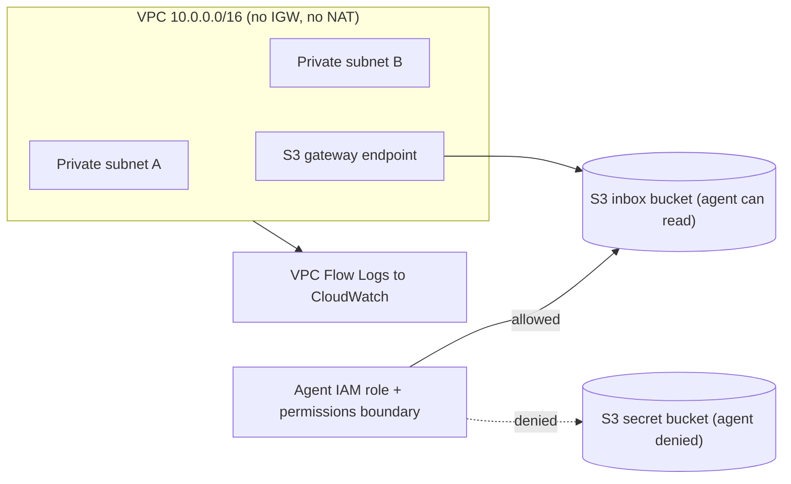

<div align="center">

<a href="https://git.io/typing-svg">
  
</a>

<br>


<br>
<a href="https://github.com/vviperinae/agent-cage/actions/workflows/terraform-security.yml">
  
</a>

</div>

<br>

## ⑅ ‧₊˚ ↬ `$ cat about_project.txt`
ʚɞ **What:** A Terraform-built AWS environment designed to run an autonomous AI agent as an *untrusted* workload.<br>
ʚɞ **Why:** Prompt injection can't be fully prevented in the model, so the infrastructure has to limit the damage when it succeeds.<br>
ʚɞ **Idea:** The guardrails *around* an agent sandbox: no internet egress, least-privilege IAM with a permissions boundary, full network logging, and every change scanned in CI before it ships.<br>
ʚɞ **Status:** Network, IAM and DevSecOps pipeline done. Detection, the agent and the injection demo are on the roadmap below.<br>

<br>

## ⑅ ‧₊˚ ↬ `$ ls architecture`



<br>

## ⑅ ‧₊˚ ↬ `$ ls security_controls`

| Layer | Control | Why it matters |
|---|---|---|
| Network | Private subnets only, **no internet gateway and no NAT** | An injected agent has nowhere to exfiltrate data to |
| Network | Free S3 **gateway endpoint** | The agent reaches S3 without touching the internet |
| Network | Default security group with **no rules** | Nothing can use the default group by accident |
| Network | **VPC Flow Logs** (ALL traffic, 365-day retention) | Every connection attempt is recorded |
| Identity | Role scoped to **one bucket**, read-only | A hijacked agent can't read the secret bucket |
| Identity | **Permissions boundary** | A hard ceiling, even if someone attaches more permissions later |
| Data | S3 **Block Public Access**, versioning, lifecycle rules | No public exposure, recoverable objects, no clutter |
| Pipeline | `fmt`, `validate` and **Checkov** on every push | Insecure changes are caught before apply |

<br>

## ⑅ ‧₊˚ ↬ `$ cat scan_results.log`
The first Checkov run against my initial code failed. I fixed what was worth fixing and documented the rest.

| | Findings |
|---|---|
| **Before** (first pipeline run) | 10 failed checks |
| **After** | 0 failed checks, skips documented in code |

**Fixed:** VPC flow logs, locked-down default security group, pinned availability zones, bucket versioning, lifecycle rules, and wildcard (`*`) IAM resources replaced with scoped ARNs.

**Deliberately skipped** (each has a reason in a `#checkov:skip` comment next to the resource):

| Check | Reason |
|---|---|
| Event notifications | No event-driven processing in this lab |
| S3 access logging | Out of scope for a disposable lab |
| Cross-region replication | Unnecessary for a disposable lab |
| KMS encryption (buckets, log group) | Default SSE-S3 is on; KMS would add cost and key-policy complexity. Listed as future hardening |

<br>

## ⑅ ‧₊˚ ↬ `$ ls project_structure`

```
agent-cage/
├── main.tf                  # root: wires the modules together
├── variables.tf
├── versions.tf              # provider + Terraform version pins
├── .terraform.lock.hcl      # pinned provider checksums (supply-chain safety)
├── modules/
│   ├── network/             # VPC, subnets, S3 endpoint, flow logs
│   └── iam/                 # buckets, agent role, permissions boundary
└── .github/workflows/
    └── terraform-security.yml   # fmt, validate, Checkov
```

<br>

## ⑅ ‧₊˚ ↬ `$ ./deploy.sh`

```bash
# prerequisites: Terraform >= 1.6, AWS CLI v2 configured with your own credentials
git clone https://github.com/vviperinae/agent-cage.git
cd agent-cage

terraform init
terraform validate
terraform plan
terraform apply

# tear everything down when finished
terraform destroy
```

> **Cost:** designed to stay close to zero. There is no NAT gateway, and the S3 endpoint is the free gateway type. Always run `terraform destroy` after a session and set an AWS budget alarm first.

<br>

## ⑅ ‧₊˚ ↬ `$ cat roadmap.md`
- [x] Network module (private VPC, S3 endpoint, flow logs)
- [x] IAM module (least-privilege role, permissions boundary, scoped buckets)
- [x] CI pipeline (fmt, validate, Checkov) with documented skips
- [ ] CloudTrail and GuardDuty for detection
- [ ] Auto-response Lambda that isolates the agent on suspicious activity
- [ ] A small agent with tool access (Lambda)
- [ ] **Attack demo:** prompt-injected document tries to read the secret bucket, and the logs and IAM denial prove the controls hold
- [ ] KMS encryption with proper key policies
- [ ] Policy-as-code guardrails (OPA/Conftest)
- [ ] Stretch: swap the agent runtime for an AWS Lambda MicroVM (subject to account access and pricing) while keeping the same network, IAM and detection controls

<br>

## ⑅ ‧₊˚ ↬ `$ cat related_work.md`
Managed agent sandboxes such as [AWS Lambda MicroVMs](https://aws.amazon.com/blogs/compute/running-self-hosted-ai-agent-sandboxes-with-aws-lambda-microvms/) solve **compute isolation**: a separate VM per session that is thrown away afterwards. They don't decide what that environment is allowed to reach or do.

Agent Cage focuses on that surrounding layer, and the two are complementary:

| Concern | Sandbox runtime | Agent Cage |
|---|---|---|
| Isolation of the code being run | Yes | Not the focus |
| Network egress control | Configurable, but check the defaults | Enforced: no internet route at all |
| Scope of identity and permissions | Needs a role | Least privilege plus a permissions boundary |
| Logging and detection | Needs setting up | Flow logs now, CloudTrail and GuardDuty planned |
| Policy checks on the infrastructure itself | Not included | Checkov in CI on every push |

<br>

## ⑅ ‧₊˚ ↬ `$ cat lessons_learned.txt`
ʚɞ Reading `terraform plan` carefully matters more than running `apply` quickly.<br>
ʚɞ Scanners flag defaults that don't fit every context. Fix what matters, and justify every skip in writing.<br>
ʚɞ Committing `.terraform.lock.hcl` pins provider versions and checksums, so CI uses the same provider as my laptop.<br>
ʚɞ State files and credentials never go in git.<br>

<br>

<div align="center">

<a href="mailto:safa_24001006@utp.edu.my">
  
</a>
<a href="https://my.linkedin.com/in/safa-sarfraz-1823b8333">
  
</a>

<br><br>

*Built for learning and portfolio purposes. Not production infrastructure.*

</div>
